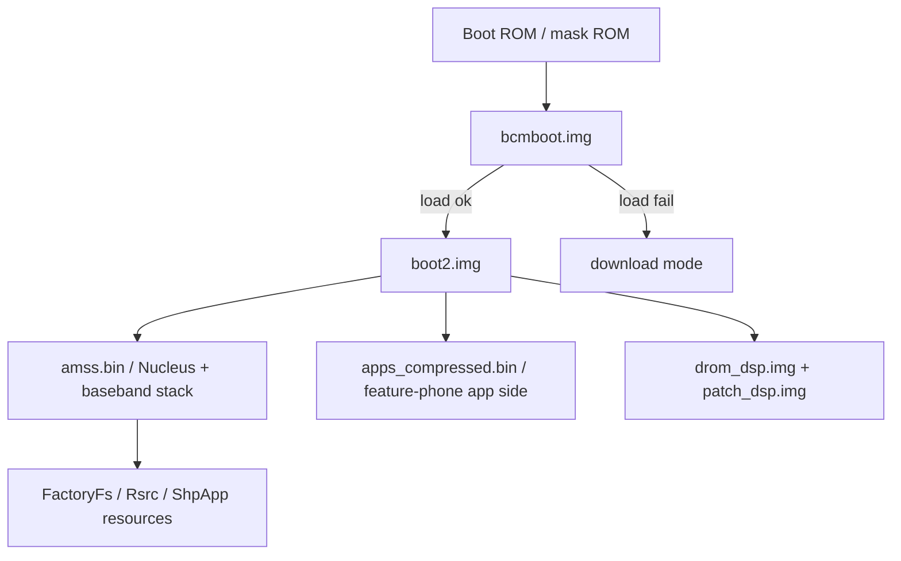

# Boot-chain notes

## Current hypothesis

## Evidence

`bcmboot.img` contains these selected strings:

| Offset | Text |
| ---: | --- |
| `0x00002286` | `Nand Boot $Revision: 3.6 $` |
| `0x0000a20a` | `Load Boot2.img Fail` |
| `0x0000a222` | `Load Boot2.img Fail : Goto DL Mode` |
| `0x0000a24e` | `Boot2 Size:` |
| `0x0000a2f6` | `NO Boot2 img, goto Download mode` |
| `0x0000a322` | `Jump to Boot2` |

`bcmboot.img` has ARM vector-like code at offset `0x40`, not at file offset
zero. This suggests an image header or table precedes executable ARM code.

## Next questions

1. What fields are stored before `bcmboot.img` offset `0x40`?
2. Does `bcmboot.img` verify `boot2.img` using a checksum, hash, signature, or
   simple size/header check?
3. What transfer protocol is used by download mode?
4. Does download mode allow RAM execution, or only flash programming?
5. What exact address is used when jumping from `bcmboot.img` to `boot2.img`?
