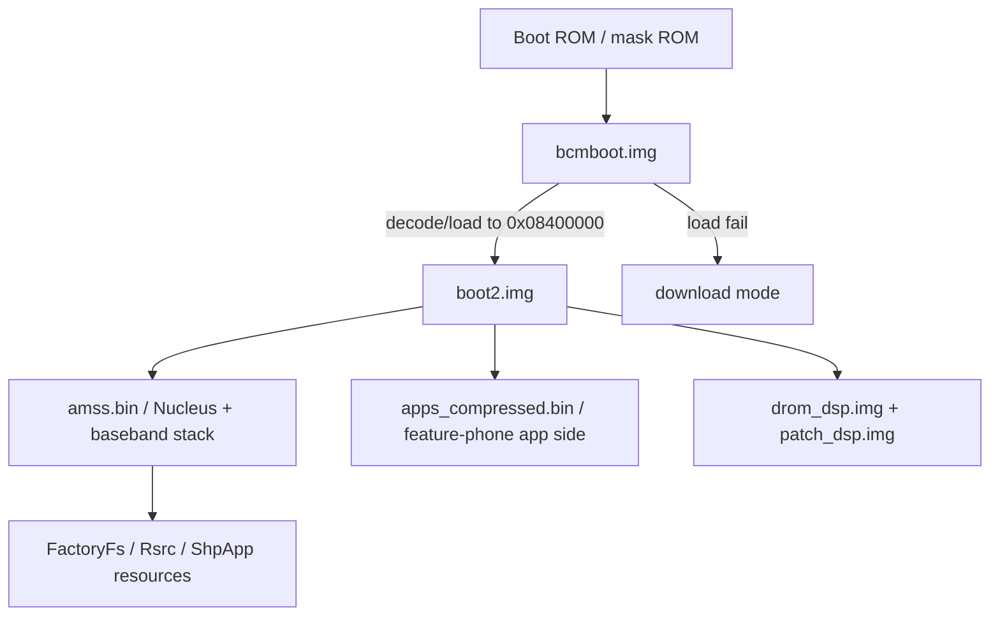

# Boot-chain notes

## Current hypothesis

## Evidence

`bcmboot.img` contains these selected strings:

| Offset | Text |
| ---: | --- |
| `0x00002286` | `Nand Boot $Revision: 3.6 $` |
| `0x0000a20a` | `Load Boot2.img Fail` |
| `0x0000a222` | `Load Boot2.img Fail : Goto DL Mode` |
| `0x0000a24e` | `Boot2 Size:` |
| `0x0000a2f6` | `NO Boot2 img, goto Download mode` |
| `0x0000a322` | `Jump to Boot2` |

`bcmboot.img` has ARM vector-like code at offset `0x40`, not at file offset
zero. This suggests an image header or table precedes executable ARM code.

With `bcmboot.img` imported from file offset `0x40` to base `0x28000000`:

- the first eight words look vector-like, but the apparent reset target
  `0x28000070` lands inside a string-output loop and is probably not the true
  cold-start entry;
- entry-like initialization code starts at `0x28000030` and sets up the stack;
- the common exception-vector target word is `0x2800066c`;
- initial stack setup computes `sp = 0x08700800`;
- boot2 copy/decode destination starts at `0x08400000`;
- before jumping, code checks `*(uint32_t *)(0x08400000 + 0x20) == 0xbabeface`;
- success path ends with `bx 0x08400000` at `0x280003a8`;
- failure path near `0x28000338` writes status values then loops forever at
  `0x28000350`.

`boot2.img` file offset `0x20` is not `0xbabeface` in the local sample, so
`bcmboot.img` is probably not jumping to the raw file bytes directly. The boot2
file is likely decoded, decrypted, decompressed, or loaded from a different NAND
representation before the RAM header check passes.

## Next questions

1. What fields are stored before `bcmboot.img` offset `0x40`?
2. Does `bcmboot.img` verify `boot2.img` using a checksum, hash, signature, or
   simple size/header check?
3. What transfer protocol is used by download mode?
4. Does download mode allow RAM execution, or only flash programming?
5. Which routine transforms `boot2.img` into the RAM image at `0x08400000`?
6. Is the `0x28000000` vector-like area used by the CPU exception model, or is
   it mainly a Broadcom image header with vector-shaped stubs?
