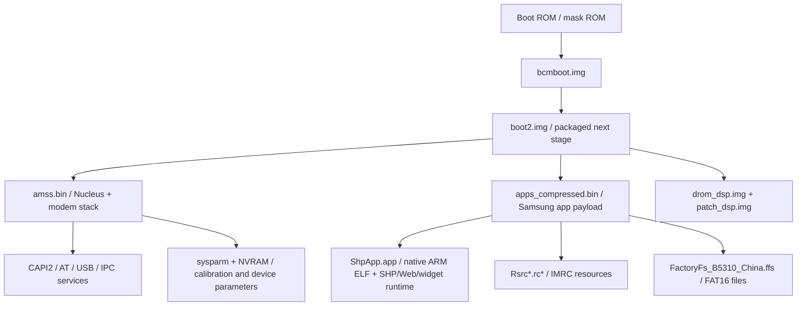

# System architecture notes

This page is a working architecture map for the GT-B5310U/BCM2153 firmware set.
It separates observed facts from current interpretation.

## High-level map

## Boot and packaging layer

- `bcmboot.img` is a small first-stage NAND boot image. Its entry-like setup is
  currently at `0x28000030` when file offset `0x40` is mapped to `0x28000000`.
- `bcmboot.img` checks the next RAM image at `0x08400000`; it expects
  `0xbabeface` at `0x08400020` before jumping to `0x08400000`.
- `boot2.img` file offset `0x20` is not `0xbabeface`, so raw file bytes are not
  the final RAM image checked by `bcmboot.img`.
- `bcmboot.img`, `boot2.img`, `amss.bin`, and `apps_compressed.bin` all contain
  a final `cd ab cd ab` marker exactly 1024 bytes before EOF. Treat the last KiB
  as Samsung/TkTool packaging metadata unless a loader proves otherwise.

## Modem / CP software layer

`amss.bin` identifies the platform as Broadcom BCM2153 and contains Nucleus PLUS
strings. The local source-path list has 686 paths and strongly suggests a full
feature-phone modem/control stack.

Source-path category counts from `tools/source_path_survey.py`:

| Category | Count | Interpretation |
| --- | ---: | --- |
| `umts_rrc_l1` | 222 | UMTS RRC/L1/MAC/RLC-related implementation |
| `gsm_gprs_edge` | 110 | GSM/GPRS/EDGE protocol stack |
| `data_socket_ip` | 55 | packet data, sockets, PCH/IP relay support |
| `sim_sms_stk` | 36 | SIM, SMS, STK, ISIM support |
| `at_v24_usb` | 35 | AT command, V.24, USB serial/control path |
| `call_ss_phonebook` | 25 | call control, supplementary services, phonebook |
| `audio_dsp` | 23 | audio codec, voice, DSP interaction |
| `cal_nv_sysparm` | 18 | calibration, NVRAM, sysparm, RF calibration |
| `rtos_nucleus` | 14 | Nucleus RTOS kernel/task primitives |
| `capi2_ipc` | 13 | CAPI2 and CP IPC interface layer |
| `platform_bcm2153` | 7 | BCM2153 IRQ/FIQ/GPIO/sleep/platform pieces |

Important implication: this is not a simple Linux/Android application processor
firmware. The primary low-level software stack is a baseband-oriented Nucleus
system with telephony protocols, services, and Samsung integration layers.

## Application and UI layer

`ShpApp.app` begins with a UTF-16-like `FimBIN` marker and contains an embedded
ARM ELF at file offset `0x192e`:

- ELF class: 32-bit;
- machine: ARM (`0x28`);
- entry: `0x0e00ad0c`;
- LOAD segment VMA: `0x0e000034`;
- program headers: 1;
- section headers: 6;
- section names include `ER_RO`, `ER_RW`, and `ZI`;
- entry code disassembles as Thumb and calls host/runtime services through
  pointer tables.

Strings in `ShpApp.app` reference Samsung SHP code paths and a Web/widget stack,
including examples such as:

- `Src\SHP\SFBalGraphicsShp.c`
- `Src\SHP\SFBalStringShp.cpp`
- `..\page\shp\EventHandlerShp.cpp`
- `..\platform\network\shp\ResourceHandleShpNet.cpp`
- `Widget`
- RSS/XML/content-type handling strings

Interpretation: the native UI/application environment likely includes a Samsung
SHP runtime with browser/widget/XML components, not only a fixed native menu
binary.

## Resource layer

`Rsrc_B5310_China.rc1` starts with `IMRC`. It contains many detected XML, PNG,
zlib, GIF, JPEG, BMP, ZIP, and SWF-like resources. First-pass magic counts
include 137 PNG headers, 122 JFIF headers, 16 XML headers, 27 `BWFXML` markers,
and dozens of SWF markers. Visible strings include `Idle`, `WidgetTray`,
`BluetoothIcon`, `GamesIcon`, `Menu`, and `Main`.

`Rsrc2_B5310U(Low).rc2` and `Rsrc2_B5310U(Mid).rc2` are likely related resource
variants, possibly display/profile/resource-quality variants. Their exact table
format is still unknown.

## Filesystem layer

`FactoryFs_B5310_China.ffs` is FAT16. Root directories observed with `fls`:

- `Debug`
- `DicDB`
- `Exe`
- `Media`
- `Mount`
- `Security`
- `Settings`
- `SystemFS`

`Exe` contains `Java` and `Mocha`. The `Java` subtree includes preinstalled J2ME
games and apps with `.jad` / `.jar` files. The `SystemFS` subtree includes:

- `Country`
- `DB`
- `Driver`
- `Media`
- `MediaSet`
- `Settings`
- `Test`
- `User`

`SystemFS/Driver` contains device/media support blobs such as camera firmware,
sound bank files, volume presets, and Broadcom WLAN firmware names.

## Parameter and calibration layer

The sample set contains `sysparm_ind.img`, `sysparm_dep.img`, and `NVRAM6.bin`.
`amss.bin` source paths and strings include calibration, RF calibration, NVRAM,
sysparm, battery/PMU, SIM, and USB configuration code. These files should be
treated as device/calibration-sensitive until their formats are understood.

## Open architecture questions

1. What exactly transforms `boot2.img` into the RAM image at `0x08400000`?
2. How does `boot2.img` relate to `apps_compressed.bin`, `ShpApp.app`, and
   `Rsrc*.rc*` during normal boot?
3. What is the exact loader format behind `FimBIN`, `PFSBIN`, and `IMRC`?
4. Is `ShpApp.app` loaded directly as a native ELF payload, or is the ELF just a
   member inside a larger Samsung container?
5. Which side owns the primary UI event loop: `ShpApp.app`, `apps_compressed`,
   or another module table inside `boot2.img`?
6. Which CAPI2/AT/USB commands expose debug, filesystem, memory, or download
   primitives?
